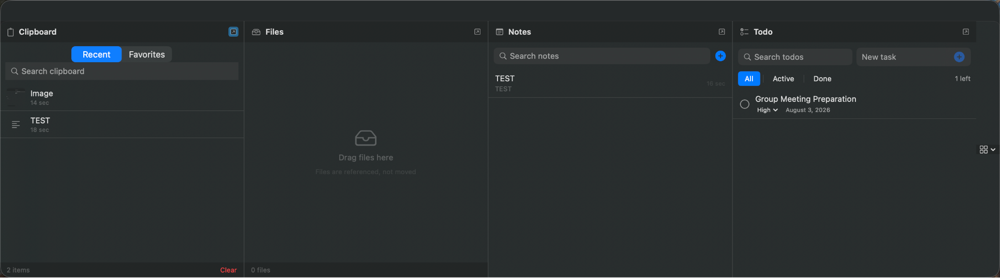

# DropShelf

A macOS dropdown-drawer app that puts clipboard history, file staging, quick
notes, and todos behind one panel that slides down from the top of your screen.

Hidden until you need it, gone the instant you're done. No Dock icon, no
desktop clutter. Built with Swift and SwiftUI.

> DropShelf is an original app inspired by the classic "dropdown drawer"
> interaction pattern. It is not affiliated with any existing product.



---

## Features

### One panel, four tools

- **Clipboard history** - automatically records text, images, and files you
  copy. Browse recent items, search, star favorites, and click any entry to
  paste it back. History survives app and system restarts.
- **File staging** - a temporary holding area. Drag files in to "shelve" them,
  drag them out into any app or Finder location. Files are referenced, not
  moved or copied. A cross-window drag-and-drop transit stop.
- **Notes** - desktop-sticky quick notes, as many as you want. Full-text search,
  pin important notes, and switch between Edit and Markdown Preview (with
  KaTeX math support via `$$...$$` and `$...$`).
- **Todo** - lightweight task list with search, filters (all / active /
  completed), priorities, due dates, and one-click completion.

### Summon and dismiss

| Trigger | Action |
| --- | --- |
| `Cmd + Shift + C` | Global hotkey toggles the panel |
| `Cmd` held + mouse to top edge | Panel slides down |
| Drag files to the top edge | Panel opens and catches the drag |

The panel slides down from the top of the screen and slides back up when you
click outside, toggle the hotkey, or pick a menu action.

### Flexible panels

- Drag the dividers between panels to resize each one.
- Reorder panels in **Preferences > Panels**.
- Detach any panel into its own floating, always-on-top window; reattach it
  from the window's close button or the panel header.
- Hide panels you don't use and restore them from **Preferences > Panels** or
  the menu bar **Panels** submenu.

### Menu bar

Click the menu bar icon (stack icon) for:

- **Show/Hide DropShelf** (`Cmd + Shift + C`)
- **New Note** / **New Todo** - create and reveal the panel
- **Clear Clipboard History**
- **Panels** - show/hide individual panels
- **Preferences...** (`Cmd + ,`)
- **Quit DropShelf** (`Cmd + Q`)

### Data and privacy

Everything is stored locally as JSON in:

```
~/Library/Application Support/DropShelf/
```

No cloud sync, no telemetry, no network calls. Your data never leaves your Mac.

---

## Requirements

- macOS 14.0 (Sonoma) or later
- Xcode Command Line Tools (`xcode-select --install`)
- Apple Silicon (arm64); Intel builds are untested

---

## Build and run

This project builds directly with `swiftc` (no SPM dependencies, no Xcode
project required). A single script handles compile, bundle staging, code
signing, and launch.

```bash
# Build, stage the .app bundle, and launch
./script/build_and_run.sh run

# Build only (no launch)
./script/build_and_run.sh build

# Run the test suite
./script/build_and_run.sh test

# Build and verify the app launches, then quit
./script/build_and_run.sh verify
```

The built app lands at `dist/DropShelf.app`.

First launch notes:

- The app is ad-hoc signed. macOS may show a Gatekeeper prompt the first time;
  right-click > **Open** (or **System Settings > Privacy & Security > Open
  Anyway**) to allow it.
- For the global hotkey and edge tracking to work, grant **Accessibility**
  permission to DropShelf in **System Settings > Privacy & Security**.

---

## Usage

1. Launch DropShelf. It lives in the menu bar; no Dock icon appears.
2. Press `Cmd + Shift + C` (or hold `Cmd` and move the mouse to the top edge)
   to slide the panel down.
3. Copy things, shelve files, jot notes, track tasks.
4. Click outside the panel (or press the hotkey again) to slide it away.

See the screenshots below, and the [Chinese readme](README.zh-CN.md) for a
localized guide.

---

## Screenshots

> Screenshots are generated by `script/capture_screenshots.sh` after granting
> **Screen Recording** permission to the terminal. Run it once you've built the
> app; it drops PNGs into `docs/screenshots/`.


> The panel slides down from the top of the screen, full width, with
> Clipboard, Files, Notes, and Todo side by side. Capture more views
> (settings, menu bar, individual panels) with `script/capture_screenshots.sh`
> after granting **Screen Recording** permission to your terminal.

---

## Project layout

```
DropShelf/
  App/            # App entry, AppDelegate, status bar menu
  Models/         # AppSettings, ClipboardItem, Note, StagedFile, TodoItem
  Services/       # PersistenceManager, ClipboardMonitor, NotesManager, ...
  Views/          # Panel views, Settings, shared Markdown preview + theme
  Window/         # DropDownPanel, WindowManager, TopEdgeTracker, hotkeys
  Resources/      # AppIcon, bundled Markdown libs (markdown-it, KaTeX, DOMPurify)
Tests/            # Migration, services, edge tracker, panel frame, markdown
script/           # build_and_run.sh, capture_screenshots.sh
dist/             # built DropShelf.app (gitignored)
```

---

## Install via Homebrew (planned)

DropShelf can be distributed as a Homebrew Cask once a GitHub release is
published. See [docs/homebrew.md](docs/homebrew.md) for the full tap and
formula setup. In short, after a tagged release:

```bash
brew tap ALLENYGY/tap
brew install --cask dropshelf
```

---

## Tech notes

- **Swift / SwiftUI**, targeting macOS 14+. Uses `@Observable`, `MenuBarExtra`,
  and `Settings` scenes.
- **WebKit** powers the Markdown preview. The renderer (`markdown-it`), math
  (`KaTeX`), and sanitizer (`DOMPurify`) are bundled offline in
  `DropShelf/Resources/Markdown/` - no network, no CDNs.
- **No third-party Swift packages.** Everything is stdlib + system frameworks.
- Custom top-edge mouse tracking (`TopEdgeTracker`) and a timer-driven slide
  animation in `WindowManager` give the dropdown feel without private APIs.

---

## License

MIT. See [LICENSE](LICENSE). Bundled JavaScript libraries in
`DropShelf/Resources/Markdown/` carry their own licenses; see
`DropShelf/Resources/Markdown/THIRD_PARTY_NOTICES.md`.

---

## Acknowledgements

Inspired by the dropdown-drawer interaction pattern popularized by apps like
Unclutter. DropShelf is an independent implementation written from scratch.
